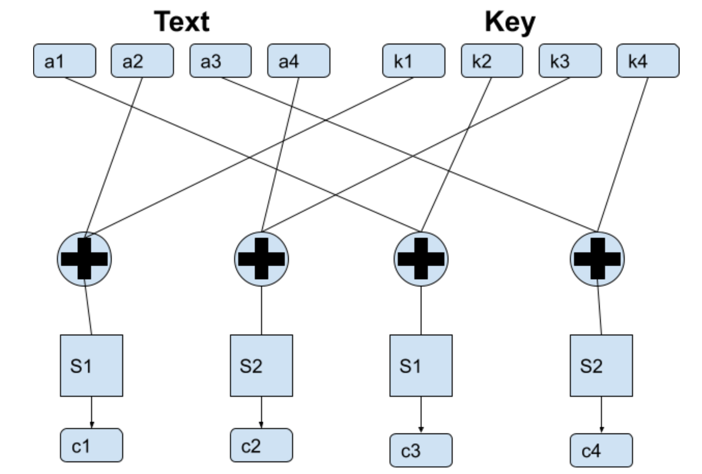
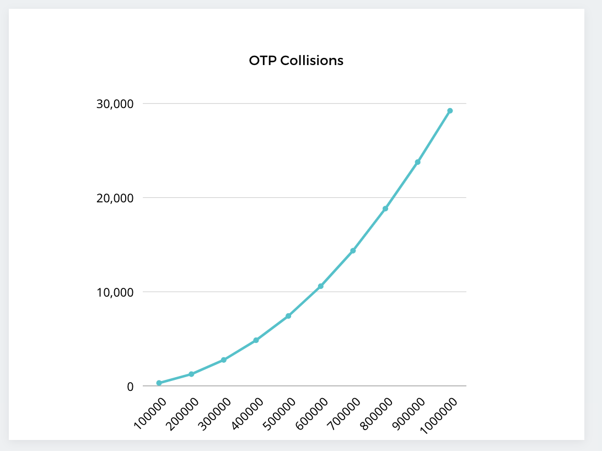

# simple-encrption

## SboxCipher
A study of implementing Sbox Cipher and the ways of improving Avalanche effect. \

## OPTAuthentication
An simple implementation of one-time password authentication with and an OPT generator and an related OPT checker. \
An extra test is written to test the cipher collision of the OPT.

